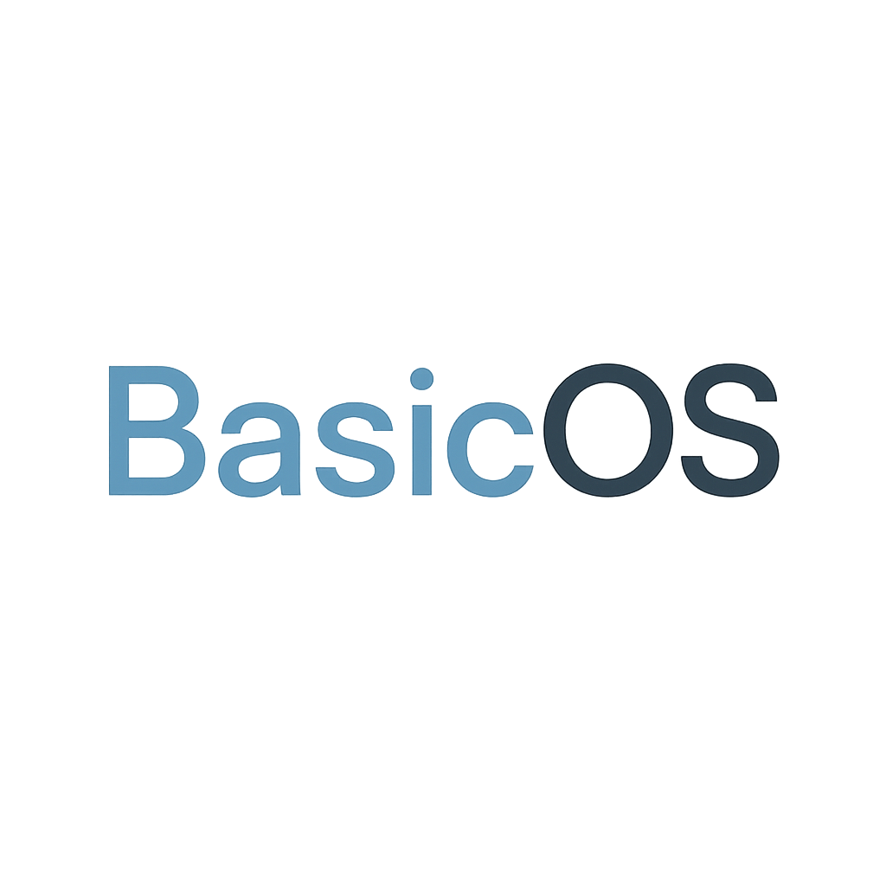

# BasicOS Custom ROMs

**BasicOS** is a lightweight, minimal, and fast custom Android OS built for simplicity and performance.  
Designed to run smoothly on low-end devices, BasicOS delivers a clean experience without bloat.

---

## 🖼️ Logo

  

---

## ✨ Features

- ⚡ Smooth and responsive interface
- 🔋 Battery-friendly, low memory usage
- 🔓 Root access (via SuperSU)
- 🎵 Custom sound pack (notification, ringtone, alarm)
- 🖋️ OneUI-inspired fonts and emojis
- 🎞️ Custom boot animation
- 🧠 System tweaks for speed and stability

---

## 📦 Installation

1. Boot into **TWRP Recovery**
2. Flash `BasicOS.zip`
3. Reboot your device
4. Enjoy!

> 🔹 A clean install (with full wipe) is strongly recommended.

---

## 🤝 Contributions

Found a bug or have a suggestion?  
Feel free to open an issue or submit a pull request. All contributions are welcome.

---

## 📄 License

This project is licensed under the **MIT License**.

---

## 🛠 Maintainer

Developed with ❤️ by BasicOS team
